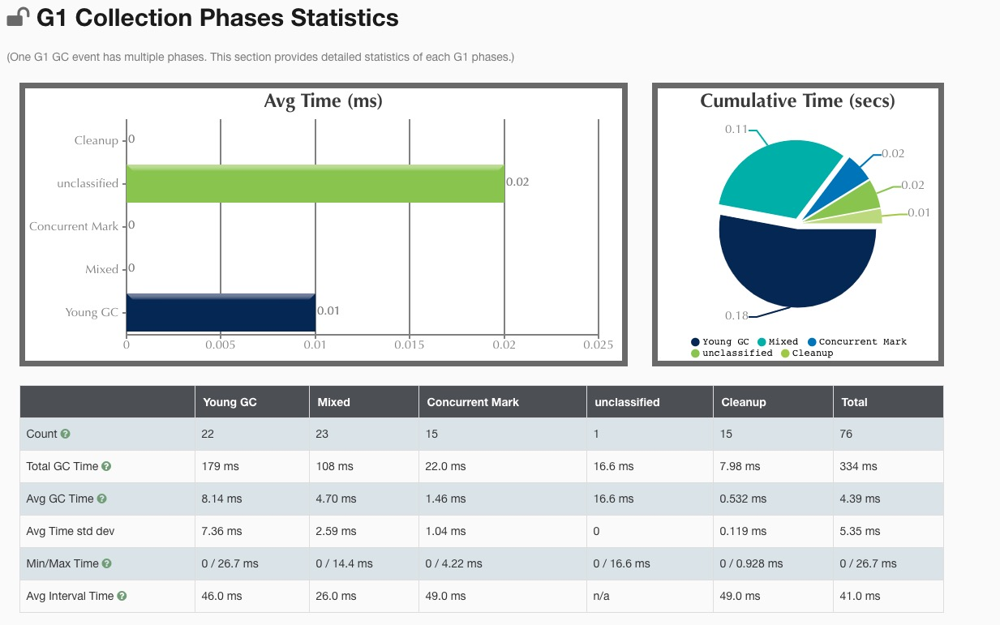

前言
> 演练的环境大部分为 4C/16G 的 Mac 系统，还有小部分的环境为 1C/2G 的云主机，Java 版本;

```bash
java version "1.8.0_221"
Java(TM) SE Runtime Environment (build 1.8.0_221-b11)
Java HotSpot(TM) 64-Bit Server VM (build 25.221-b11, mixed mode)
```
关于 GC 日志比较关心的两个数据
> GC暂停时间，以及GC之后的内存使用量/使用率。

在 1C/2G 的云主机中， `Xmx1G` 的情况下并行GC 和 串行GC 的运行效果相差不大，

### `Xmx128M` 的情况下
在 `-Xmx128m` 的情况下， 大部分的都会发生 `oom` 的情况
> 超过 98% 的时间都在GC，则会出现 oom

### 在 `-Xmx512M` 的情况下，
> GC事件的持续时间，通过三个部分来衡量: user 表示GC线程所消耗的总CPU时间， sys 表示 操作系统调用和系统等待事件所消耗的时间; real 则表示应用程序实际暂停的时间

- 串行GC并没有发生full GC，串行垃圾收集器(Serial Garbage Collector)只使用单个线程， 所以在这里 real = user + system
- 并行GC发生了8次full Gc，发生Full GC 时，Young 区占用变成了0，全部移动到了 Old 区。Gc 持续时间： real 相近于 (user + system) / GC_thread_count
> 并行垃圾收集器适用于多核服务器，其主要目标是增加系统吞吐量(也就是降低GC总体消耗的时间)

-　CMSGC
```
2020-10-26T19:48:03.174-0800: [CMS-concurrent-abortable-preclean-start]
2020-10-26T19:48:03.196-0800: [GC (Allocation Failure) 2020-10-26T19:48:03.196-0800: [ParNew: 157246K->17471K(157248K), 0.0334904 secs] 371100K->281306K(506816K), 0.0335235 secs] [Times: user=0.22 sys=0.03, real=0.03 secs]
2020-10-26T19:48:03.252-0800: [GC (Allocation Failure) 2020-10-26T19:48:03.252-0800: [ParNew: 157247K->17470K(157248K), 0.0333568 secs] 421082K->327804K(506816K), 0.0333914 secs] [Times: user=0.21 sys=0.02, real=0.03 secs]
2020-10-26T19:48:03.306-0800: [GC (Allocation Failure) 2020-10-26T19:48:03.306-0800: [ParNew: 157246K->157246K(157248K), 0.0000181 secs]2020-10-26T19:48:03.306-0800: [CMS2020-10-26T19:48:03.306-0800: [CMS-concurrent-abortable-preclean: 0.003/0.132 secs] [Times: user=0.51 sys=0.05, real=0.13 secs]
 (concurrent mode failure): 310334K->256773K(349568K), 0.0570866 secs] 467580K->256773K(506816K), [Metaspace: 2728K->2728K(1056768K)], 0.0571654 secs] [Times: user=0.05 sys=0.00, real=0.06 secs]
```
出现`concurrent mode failure` 使得cms gc 降级成了 serial gc，产生原因

结合文档
```
 However, if the CMS collector is unable to finish reclaiming the unreachable objects before the tenured generation fills up, or if an allocation cannot be satisfied with the available free space blocks in the tenured generation, then the application is paused and the collection is completed with all the application threads stopped
```
简单翻译一下：当cms gc在老年代填满之前不能完成回收不可达对象时，或者没有老年代没有更多空白空间去申请时，会停止所有线程去完成收集。

停止所有线程，和 serial Gc 就一样了。

- g1 gc

```
G1 Evacuation Pause(young)
initial-mark
GC concurrent-root-region-scan-start
GC concurrent-mark-start
remark
leanup
G1 Evacuation Pause) (young)
GC pause (G1 Evacuation Pause) (mixed)
```
查看第一个周期的执行顺序，没有严格的分新生代，老年代。按照整理去做回收。

利用[gceasy](https://gceasy.io/)分析日志


[Xmx的详细日志](./Xmx512M)
