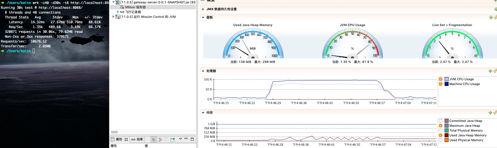
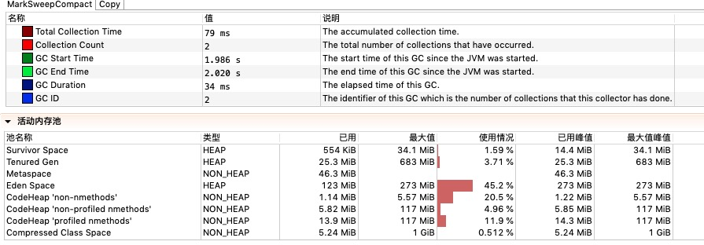
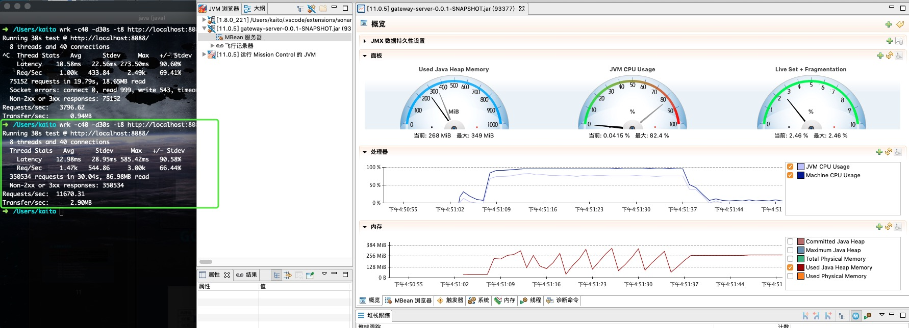
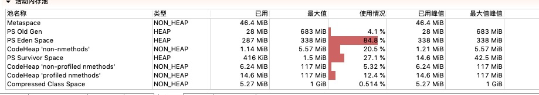
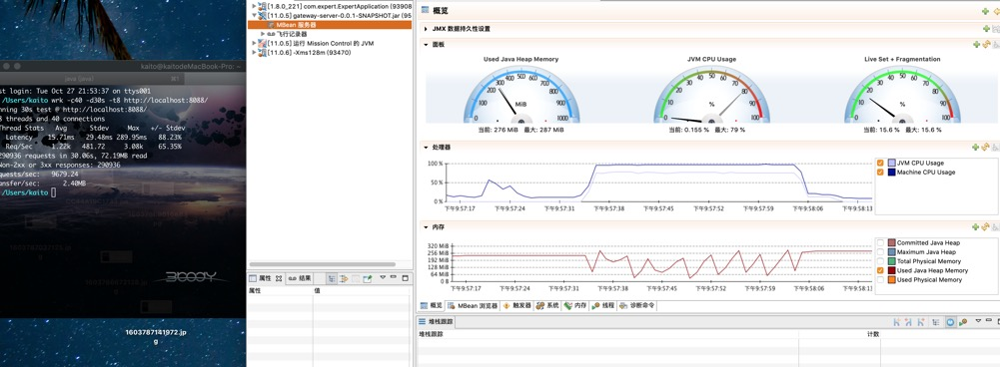
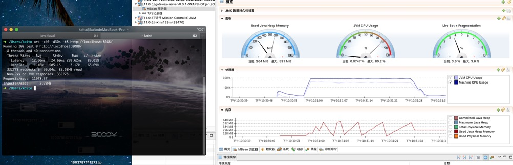

#### 测试环境
mac ，4c/8thread/16g, java 环境
```
java version "11.0.5" 2019-10-15 LTS
Java(TM) SE Runtime Environment 18.9 (build 11.0.5+10-LTS)
Java HotSpot(TM) 64-Bit Server VM 18.9 (build 11.0.5+10-LTS, mixed mode)
```

由于版本是1.8.0_221 启动不了jmc, 所以重新下一个，[jmc下载链接](https://jdk.java.net/jmc/)

### SerialGC



### ParallelGC



### CMSGC


### C1GC


总结：
吞吐量 ： parallelGc > G1 Gc > SerialGC > CMS Gc
小内存下，并行 GC 还是有一定的优势的