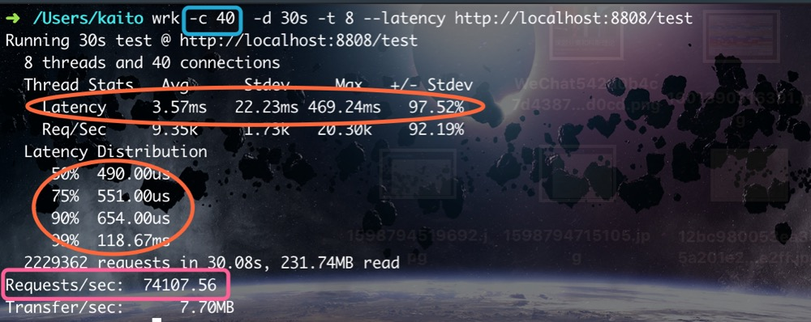

# 学习笔记
## 什么是高性能
* 高并发用户（Concurrent Users）
* 高吞吐量（Throughout）
* 低延迟（Latency）

以图为例：

- -c 40 为40个并发
- latency 为延迟，低延迟
- Request/sec 为吞吐率单位，这个越高说明性能越好

### 缺点：
系统复杂度 x10 +
建设与维护成本 ++++
故障或 BUG 导致的破坏性 x10以上

### 应对策略
稳定性建设（混沌工程[chaos Engineering]）
> netfix 的混沌工程 [chaosmonkey](https://netflix.github.io/chaosmonkey/)

## Netty 如何实现高性能

## Netty 网络程序优化

## 典型应用：API 网关

# 作业
 - 整合 httpClient / OkClient
 - 使用 netty 实现后端访问（可选）
 - 实现过滤器
 - 实现路由（可选）

# 项目目录说明
## 8808 server-backend -- backendServer
## 05作业目录：实现一个网关 -- gateway
 > 基础代码 https://github.com/kimmking/JavaCourseCodes 02nio/nio02 文件夹

