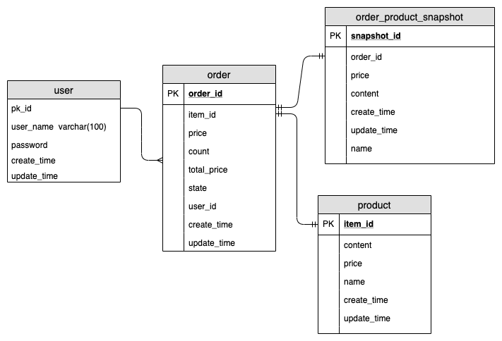

# 简单订单表设计说明

> 场景说明：用于单库， 业务量不大的情况，都是自营产品

## V1.0 功能说明：
> 业务需求：实现用户密码登陆，商品只需要名称，内容和单价，不需要上下架，有了默认为上架，每个订单只能只有一个商品，商品的更改不影响已经生成购买的商品。

### 数据库分析：
#### 用户
用户密码登陆
#### 商品
名称，详细说明，单价
#### 订单
商品快照，单价，数量，总价， 状态
#### 商品快照
名称，详细说明，单价，原商品编码

[sql文件](./sql/1.sql)
----

## 说明
该项目不包含商品的规格模块，商品分类模块，评论系统，支付系统（支付，退款，收营台等），购物车模块，物流系统，im系统（客服系统等），资源系统（短视频，图片等）， 商品编码模块，营销系统（红包，优惠券等），合同系统，发票系统，旺铺系统（门面装修等），库存系统，推荐系统（最简单的应用看一看，还有千人千面的首页等）。库存系统可能会引申出供应链管理，其中包含了物资管理系统，财务管理系统，供应商管理等等；营销系统中可能涉及到内容相关的审核等，这些暂时不考虑。

在某些B端业务中，商品是没有库存概念的，直接像供应商或者平台下单，这个单是定制的，需要供应商确定该订单，就像外卖需要商家确认接单一样。