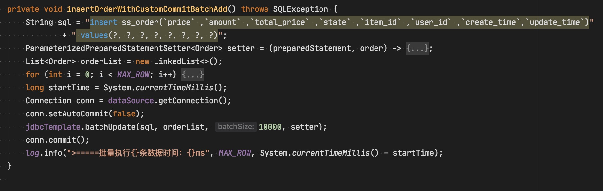
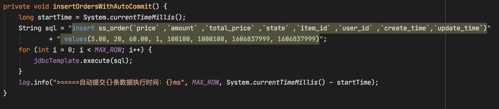

### 13-02 作业
由于 100w 插入的数量级的时间过长。暂时先用10w的数量级的用测试
1. 直接用命令导入sql文件是最快的，命令为：`source ss_order.sql`, 每条语句的执行时间为：`0.00021150`的量级， 最后 commit 的时间为：`0.00321000`；

2. 使用存储过程, 执行时间：`138.571000s`
```sql
delimiter;;
CREATE PROCEDURE idata () BEGIN
	DECLARE
		i INT;
	SET i = 1;
	WHILE
		( i <= 100000 ) DO
			INSERT ss_order ( `price`, `amount`, `total_price`, `state`, `item_id`, `user_id`, `create_time`, `update_time` )
		VALUES
			( 3.00, 20, 60.00, 1, 100100, 1000100, 1606837999, 1606837999 );
		SET i = i + 1;
	END WHILE;
END;;
delimiter;
CALL idata ();
```

> 3 和 4 的具体代码在 13-02 中

3. 10 w 批量插入后一次提交一次 执行时间：228112ms, 具体代码


4. 10 w 一条一条的插入执行时间为：346691ms ，具体代码


### 14-03
> 当 spring boot 使用 2.4.0, ss-jdbc 5.0.0 时可以参考  https://github.com/apache/shardingsphere/issues/8299